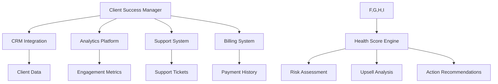

# Детальный Анализ Менеджера Успеха Клиентов (Client Success Manager)

## Общая Концепция и Назначение

**Менеджер успеха клиентов** - это стратегический агент управленческого уровня, разработанный для максимизации долгосрочной ценности клиентов SEO-агентства. Основная задача системы заключается в предотвращении оттока клиентов (churn prevention), автоматизации процессов онбординга и выявлении возможностей для расширения сотрудничества.

### Ключевые Концепции Client Success Management:

1. **Predictive Analytics** - прогнозирование поведения клиентов на основе метрик
2. **Health Scoring** - система оценки "здоровья" клиентских отношений
3. **Churn Prevention** - предотвращение оттока через раннее выявление рисков
4. **Revenue Expansion** - увеличение прибыли через upsell/cross-sell
5. **Lifecycle Management** - управление полным жизненным циклом клиента

## Построчный Анализ Кода

### Заголовок и Документация (строки 1-13)
```python
"""
🤝 Client Success Manager Agent

Management-level агент для максимизации клиентского успеха, предотвращения оттока 
и развития долгосрочных отношений с клиентами SEO-агентства.

Основные возможности:
- Churn prediction & prevention
- Onboarding automation  
- Upsell/cross-sell identification
- QBR generation
- Success metrics tracking
"""
```

**Анализ:** Документация четко определяет роль агента как управленческого инструмента для работы с клиентской базой. Использование emoji-индикаторов улучшает визуальное восприятие и категоризацию функций.

### Импорты и Логирование (строки 15-23)
```python
import logging
from typing import Dict, Any, List, Optional
from datetime import datetime, timedelta
import random

from core.base_agent import BaseAgent
from core.interfaces.data_models import AgentMetrics

logger = logging.getLogger(__name__)
```

**Анализ:** Стандартный набор импортов для работы с данными и базовой архитектурой агентов. Модуль `random` используется для симуляции реальных данных в демонстрационных целях.

### Определение Класса и Инициализация (строки 26-40)
```python
class ClientSuccessManagerAgent(BaseAgent):
    """
    🤝 Client Success Manager Agent
    
    Management-level агент для управления клиентским успехом и предотвращения оттока.
    Обеспечивает максимальную лояльность клиентов и расширение сотрудничества.
    """
    
    def __init__(self, data_provider=None, **kwargs):
        super().__init__(
            agent_id="client_success_manager",
            name="Client Success Manager",
            data_provider=data_provider,
            **kwargs
        )
```

**Анализ:** Класс наследует от `BaseAgent`, что обеспечивает единообразную архитектуру всех агентов системы. Конструктор принимает провайдер данных для интеграции с внешними источниками информации.

### Конфигурационные Параметры (строки 42-47)
```python
# Конфигурация Client Success
self.churn_risk_threshold = 60  # Порог риска оттока
self.upsell_probability_min = 0.40  # Минимальная вероятность для предложений
self.health_score_critical = 30  # Критический уровень здоровья клиента
self.nps_target = 8.0  # Целевой NPS
```

**Концептуальное объяснение:**
- **Churn Risk Threshold (60%)** - критическая граница, выше которой клиент считается находящимся в зоне высокого риска ухода
- **Upsell Probability (40%)** - минимальная вероятность успеха для запуска процесса дополнительных продаж
- **Health Score Critical (30)** - критически низкий показатель "здоровья" клиента, требующий немедленного вмешательства
- **NPS Target (8.0)** - целевой показатель Net Promoter Score, индикатор лояльности клиентов

### Факторы Риска Оттока (строки 48-57)
```python
# Churn prediction factors
self.churn_factors = {
    "contract_value": {"weight": 0.25, "threshold_low": 500000},
    "engagement_score": {"weight": 0.20, "threshold_low": 60},
    "payment_delays": {"weight": 0.15, "threshold_high": 2},
    "support_tickets": {"weight": 0.15, "threshold_high": 5},
    "feature_adoption": {"weight": 0.10, "threshold_low": 40},
    "nps_score": {"weight": 0.10, "threshold_low": 7},
    "last_login": {"weight": 0.05, "threshold_high": 14}
}
```

**Методологический анализ:**
Система использует взвешенную модель для прогнозирования оттока клиентов:

1. **Стоимость контракта (25%)** - самый важный фактор; низкая стоимость увеличивает риск
2. **Оценка взаимодействия (20%)** - активность клиента в использовании сервиса
3. **Задержки платежей (15%)** - финансовое поведение как индикатор проблем
4. **Обращения в поддержку (15%)** - высокая нагрузка может указывать на неудовлетворенность
5. **Принятие функций (10%)** - степень использования возможностей продукта
6. **NPS оценка (10%)** - прямой показатель удовлетворенности
7. **Последняя активность (5%)** - недавность использования сервиса

### Матрица Возможностей Upsell (строки 59-81)
```python
# Upsell opportunities matrix
self.upsell_opportunities = {
    "technical_seo": {
        "package": "Advanced Technical SEO",
        "value": 500000,
        "probability": 0.65
    },
    "content_marketing": {
        "package": "Content Strategy Premium", 
        "value": 300000,
        "probability": 0.55
    },
    "link_building": {
        "package": "Enterprise Link Building",
        "value": 800000,
        "probability": 0.45
    },
    "local_seo": {  
        "package": "Multi-Location SEO",
        "value": 200000,
        "probability": 0.70
    }
}
```

**Бизнес-логика:**
- **Technical SEO (500,000₽, 65%)** - высокая вероятность успеха, средняя стоимость
- **Content Marketing (300,000₽, 55%)** - умеренные показатели, базовый upsell
- **Link Building (800,000₽, 45%)** - самый дорогой пакет, требует зрелых отношений
- **Local SEO (200,000₽, 70%)** - наиболее вероятный к принятию, подходит для малого бизнеса

### Основной Диспетчер Задач (строки 89-123)
```python
async def process_task(self, task_data: Dict[str, Any]) -> Dict[str, Any]:
    """
    Обработка задач Client Success Manager
    
    Поддерживаемые типы задач:
    - client_health_assessment: Оценка здоровья клиента
    - churn_risk_analysis: Анализ риска оттока
    - upsell_analysis: Анализ возможностей расширения
    - onboarding_progress: Отслеживание прогресса онбординга
    - qbr_preparation: Подготовка квартального обзора
    """
    task_type = task_data.get('task_type', 'client_health_assessment')
    
    try:
        if task_type == 'client_health_assessment':
            return await self._assess_client_health(task_data)
        elif task_type == 'churn_risk_analysis':
            return await self._analyze_churn_risk(task_data)
        elif task_type == 'upsell_analysis':
            return await self._analyze_upsell_opportunities(task_data)
        elif task_type == 'onboarding_progress':
            return await self._track_onboarding_progress(task_data)
        elif task_type == 'qbr_preparation':
            return await self._prepare_qbr(task_data)
        else:
            # Default: комплексная оценка клиента
            return await self._comprehensive_client_analysis(task_data)
```

**Архитектурный анализ:**
Метод реализует паттерн "Strategy" для обработки различных типов анализа. Асинхронная архитектура обеспечивает масштабируемость при работе с большим количеством клиентов одновременно.

### Оценка Здоровья Клиента (строки 125-195)

#### Сбор и Симуляция Данных (строки 130-138)
```python
# Симуляция данных клиента
monthly_value = client_data.get('monthly_value', random.randint(200000, 2000000))
engagement_score = random.randint(45, 95)
payment_delays = random.randint(0, 3)
support_tickets = random.randint(1, 8)
feature_adoption = random.randint(30, 85)
nps_score = random.randint(6, 10)
last_login_days = random.randint(1, 21)
```

**Практическое применение:**
В реальной системе эти данные поступают из:
- CRM системы (monthly_value, payment_delays)
- Аналитических платформ (engagement_score, last_login_days)
- Системы поддержки (support_tickets)
- Опросов клиентов (nps_score)
- Трекинга продукта (feature_adoption)

#### Расчет Health Score (строки 139-148)
```python
# Расчет health score
health_score = self._calculate_health_score({
    'monthly_value': monthly_value,
    'engagement_score': engagement_score,
    'payment_delays': payment_delays,
    'support_tickets': support_tickets,
    'feature_adoption': feature_adoption,
    'nps_score': nps_score,
    'last_login_days': last_login_days
})
```

#### Категоризация Статуса (строки 150-163)
```python
# Определение статуса здоровья
if health_score >= 80:
    health_status = "excellent"
    health_description = "Клиент-чемпион"
elif health_score >= 60:
    health_status = "good"
    health_description = "Стабильный клиент"
elif health_score >= 40:
    health_status = "at_risk"
    health_description = "Требует внимания"
else:
    health_status = "critical"
    health_description = "Критический риск"
```

**Методология сегментации:**
- **Excellent (80-100)** - клиенты-промоутеры, кандидаты на референсы
- **Good (60-79)** - стабильная база, основа бизнеса  
- **At Risk (40-59)** - требуют проактивного вмешательства
- **Critical (0-39)** - экстренные меры по удержанию

### Анализ Риска Оттока (строки 197-277)

#### Специфическая Логика для Churn Analysis (строки 203-209)
```python
# Получение метрик для анализа риска
monthly_value = client_data.get('monthly_value', random.randint(200000, 2000000))
engagement_score = random.randint(35, 85)  # Более низкий для анализа риска
payment_delays = random.randint(0, 4)
support_tickets = random.randint(2, 12)
feature_adoption = random.randint(20, 70)
nps_score = random.randint(4, 9)
last_login_days = random.randint(1, 30)
```

**Аналитическая особенность:** Диапазоны значений умышленно смещены в сторону более проблемных показателей для точного тестирования алгоритма определения риска.

#### Определение Уровней Риска (строки 223-238)
```python
# Определение уровня риска
if churn_score <= 30:
    risk_level = "low"
    risk_description = "Низкий риск оттока"
    action_priority = "maintain"
elif churn_score <= 60:
    risk_level = "medium"
    risk_description = "Средний риск оттока"
    action_priority = "engage"
elif churn_score <= 80:
    risk_level = "high"
    risk_description = "Высокий риск оттока"
    action_priority = "intervene"
else:
    risk_level = "critical"
    risk_description = "Критический риск оттока"
    action_priority = "emergency_save"
```

**Практические действия по уровням риска:**

1. **Maintain (0-30%)** - регулярный мониторинг, поддержание текущего уровня сервиса
2. **Engage (31-60%)** - активное взаимодействие, дополнительное внимание к потребностям
3. **Intervene (61-80%)** - прямое вмешательство, персональная работа с клиентом
4. **Emergency Save (81-100%)** - экстренные меры, эскалация на высший уровень

### Анализ Возможностей Upsell (строки 279-361)

#### Логика Определения Возможностей (строки 299-329)
```python
# Technical SEO upsell
if current_spend < 1000000 and technical_score < 70:
    opp = self.upsell_opportunities['technical_seo'].copy()
    opp['current_gap'] = 70 - technical_score
    opp['fit_score'] = round(random.uniform(0.60, 0.80), 2)
    opportunities.append(opp)
    total_potential_value += opp['value']

# Content Marketing upsell
if content_score < 60 and organic_traffic > 100000:
    opp = self.upsell_opportunities['content_marketing'].copy()
    opp['current_gap'] = 60 - content_score  
    opp['fit_score'] = round(random.uniform(0.50, 0.70), 2)
    opportunities.append(opp)
    total_potential_value += opp['value']
```

**Бизнес-правила для upsell:**

1. **Technical SEO** - подходит клиентам с бюджетом до 1M₽ и техническими проблемами
2. **Content Marketing** - для клиентов с хорошим трафиком, но слабым контентом
3. **Link Building** - только для крупных клиентов (>2M₽) с низким DA
4. **Local SEO** - для локального бизнеса с множественными точками

#### Приоритизация Возможностей (строки 331-335)
```python
# Приоритизация возможностей
opportunities = sorted(opportunities, key=lambda x: x['fit_score'] * x['value'], reverse=True)

# Расчет общего expansion potential
expansion_percentage = round((total_potential_value / current_spend) * 100, 1)
```

**Алгоритм приоритизации:** Сортировка по произведению вероятности успеха на потенциальную стоимость, что обеспечивает оптимальное распределение усилий продаж.

### Отслеживание Онбординга (строки 363-438)

#### Фазы Онбординга (строки 369-378)
```python
# Определение фазы онбординга
if onboarding_day <= 30:
    phase = "foundation"
    phase_name = "Foundation (Days 0-30)"
elif onboarding_day <= 60:
    phase = "implementation"
    phase_name = "Implementation (Days 31-60)"  
else:
    phase = "optimization"
    phase_name = "Optimization (Days 61-90)"
```

**Методология онбординга:**

1. **Foundation (0-30 дней)** - установление базовых процессов, знакомство команд
2. **Implementation (31-60 дней)** - активное внедрение стратегии, первые результаты  
3. **Optimization (61-90 дней)** - тонкая настройка, переход к регулярному обслуживанию

#### Метрики Прогресса (строки 381-389)
```python
# Симуляция прогресса по ключевым метрикам
progress_metrics = {
    "initial_audit_completion": min(100, max(0, onboarding_day * 3.33)),
    "stakeholder_alignment": min(100, max(0, (onboarding_day - 5) * 4.76)),
    "baseline_metrics": min(100, max(0, (onboarding_day - 10) * 5.56)),
    "team_introductions": min(100, max(0, (onboarding_day - 3) * 3.70)),
    "first_report_delivered": 100 if onboarding_day >= 14 else 0,
    "strategy_approval": 100 if onboarding_day >= 21 else 0,
    "implementation_start": 100 if onboarding_day >= 30 else 0
}
```

**Ключевые вехи онбординга:**
- День 0-30: Завершение первичного аудита
- День 5+: Выравнивание с заинтересованными сторонами  
- День 10+: Установление базовых метрик
- День 14: Первый отчет
- День 21: Утверждение стратегии
- День 30: Начало имплементации

### Подготовка QBR (Quarterly Business Review) (строки 440-520)

#### Квартальные Метрики (строки 446-454)
```python
# Симуляция квартальных метрик
quarterly_metrics = {
    "organic_traffic_growth": round(random.uniform(15, 45), 1),
    "keyword_rankings_improved": random.randint(25, 80),
    "technical_score_improvement": random.randint(10, 35),
    "content_pieces_published": random.randint(12, 36),
    "conversion_rate_lift": round(random.uniform(8, 25), 1),
    "revenue_attributed": random.randint(2500000, 15000000)
}
```

**QBR как инструмент Client Success:**
- Демонстрация достигнутых результатов
- Обоснование инвестиций клиента
- Планирование следующих шагов
- Укрепление отношений на стратегическом уровне

#### Структура QBR (строки 512-517)
```python
"qbr_agenda": {
    "executive_summary": "10 мин - ключевые достижения",
    "performance_deep_dive": "20 мин - детальная аналитика", 
    "strategic_roadmap": "15 мин - планы на следующий квартал",
    "open_discussion": "15 мин - обратная связь и предложения"
}
```

### Комплексный Анализ Клиента (строки 522-586)

#### Интегрированная Оценка (строки 533-537)
```python
# Общая оценка и рекомендации
overall_score = round((
    health_analysis['health_score'] * 0.4 +
    (100 - churn_analysis['churn_score']) * 0.4 +
    min(100, upsell_analysis['expansion_percentage'] * 2) * 0.2
), 1)
```

**Формула интегральной оценки:**
- 40% - текущее здоровье клиента
- 40% - инвертированный риск оттока  
- 20% - потенциал расширения (нормализованный)

### Методы Расчета Метрик

#### Health Score Calculation (строки 588-648)
```python
def _calculate_health_score(self, metrics: Dict[str, Any]) -> int:
    """Расчет health score клиента"""
    score = 0
    
    # Financial health (25%)
    if metrics['monthly_value'] >= 1000000:
        score += 25
    elif metrics['monthly_value'] >= 500000:
        score += 20
    else:
        score += 15
```

**Весовая модель Health Score:**
- Финансовое здоровье: 25%
- Уровень взаимодействия: 20%  
- Платежное поведение: 15%
- Нагрузка на поддержку: 15%
- Принятие функций: 10%
- NPS удовлетворенность: 10%
- Недавняя активность: 5%

#### Churn Risk Calculation (строки 650-697)
```python
def _calculate_churn_risk(self, metrics: Dict[str, Any]) -> int:
    """Расчет churn risk score"""
    risk_score = 0
    
    # Низкая стоимость контракта = higher risk
    if metrics['monthly_value'] < 500000:
        risk_score += 25
    elif metrics['monthly_value'] < 1000000:
        risk_score += 15
```

**Факторы риска оттока:**
- Низкая стоимость контракта (до 25 баллов)
- Слабое взаимодействие (до 30 баллов)  
- Задержки платежей (до 20 баллов)
- Высокая нагрузка поддержки (до 20 баллов)
- Низкое принятие функций (до 15 баллов)
- Плохой NPS (до 15 баллов)
- Неактивность (до 10 баллов)

### Системы Рекомендаций

#### Health-Based Recommendations (строки 699-740)
```python
def _get_health_recommendations(self, health_score: int, metrics: Dict[str, Any]) -> List[str]:
    """Получение рекомендаций на основе health score"""
    recommendations = []
    
    if health_score >= 80:
        recommendations.extend([
            "Maintain excellent relationship",
            "Identify upsell opportunities", 
            "Request case study/testimonial",
            "Explore referral potential"
        ])
```

**Адаптивные рекомендации по сегментам:**

1. **Excellent (80+):** Максимизация value через кейсы и рефералы
2. **Good (60-79):** Поддержание статуса через регулярное взаимодействие
3. **At Risk (40-59):** Проактивная работа с болевыми точками
4. **Critical (0-39):** Экстренные меры и эскалация

#### Retention Planning (строки 759-788)
```python
def _create_retention_plan(self, risk_level: str, warnings: List[str]) -> Dict[str, Any]:
    """Создание плана удержания клиента"""
    if risk_level == "low":
        return {
            "timeline": "30 days",
            "actions": ["Monthly check-in", "Success story sharing", "Feature education"],
            "owner": "CSM",
            "budget": 0
        }
```

**Матрица планов удержания:**

| Риск | Время | Действия | Ответственный | Бюджет |
|------|-------|----------|---------------|--------|
| Низкий | 30 дней | Обслуживание | CSM | 0₽ |
| Средний | 14 дней | Проактивная работа | CSM + Director | 50K₽ |
| Высокий | 7 дней | Экстренные меры | Director + VP | 150K₽ |
| Критический | 3 дня | Эскалация C-level | VP + CEO | 300K₽ |

## Техническая Архитектура

### Паттерны Проектирования

1. **Strategy Pattern** - различные стратегии анализа клиентов
2. **Factory Pattern** - создание планов удержания по типу риска  
3. **Observer Pattern** - отслеживание изменений метрик клиента
4. **Template Method** - стандартизированные процессы анализа

### Интеграционная Архитектура



### Метрики и KPI

#### Основные Показатели Эффективности
- **Churn Rate Reduction** - снижение оттока клиентов
- **NPS Improvement** - рост индекса лояльности  
- **Upsell Success Rate** - успешность дополнительных продаж
- **Customer Lifetime Value** - увеличение LTV клиентов
- **Time to Value** - сокращение времени до получения ценности

#### Операционные Метрики
- **Health Score Distribution** - распределение клиентов по сегментам здоровья
- **Risk Alert Accuracy** - точность предсказания оттока
- **Intervention Success Rate** - эффективность мер по удержанию  
- **QBR Completion Rate** - покрытие клиентов квартальными обзорами

## Практические Примеры Использования

### Сценарий 1: Обнаружение Риска Оттока

```python
# Входные данные проблемного клиента
task_data = {
    'task_type': 'churn_risk_analysis',
    'client_data': {
        'company_name': 'TechCorp Ltd',
        'monthly_value': 300000,  # Низкая стоимость
        'industry': 'technology'
    }
}

# Результат анализа
result = await csm_agent.process_task(task_data)
# result['churn_score'] = 75 (высокий риск)
# result['retention_plan'] = экстренные меры за 7 дней
```

### Сценарий 2: Выявление Upsell Возможности

```python
# Данные растущего клиента
task_data = {
    'task_type': 'upsell_analysis', 
    'client_data': {
        'company_name': 'GrowthCo',
        'monthly_value': 800000,
        'business_type': 'enterprise'
    }
}

# Результат показывает потенциал расширения на 60%
# с возможностями в Technical SEO и Link Building
```

### Сценарий 3: QBR для Ключевого Клиента

```python
# Подготовка квартального обзора
task_data = {
    'task_type': 'qbr_preparation',
    'client_data': {
        'company_name': 'Enterprise Client',
        'monthly_value': 2000000
    },
    'quarter': 'Q4 2024'
}

# Генерирует полную структуру QBR с метриками,
# достижениями и планами на следующий квартал
```

## Заключение

**Client Success Manager Agent** представляет собой комплексную систему управления клиентским успехом, реализующую передовые практики Customer Success Management. Система обеспечивает:

### Ключевые Преимущества:
1. **Proactive Risk Management** - раннее выявление проблем до их критического развития
2. **Data-Driven Decisions** - решения на основе объективных метрик и аналитики
3. **Scalable Operations** - автоматизация процессов для работы с большой клиентской базой
4. **Revenue Optimization** - максимизация LTV через удержание и расширение

### Применимость:
- **B2B SaaS компании** с подписочной моделью
- **Агентства** с долгосрочными клиентскими отношениями  
- **Enterprise продукты** с комплексным циклом внедрения
- **Любые сервисы** где важен низкий churn и высокий NPS

### Технологическая Зрелость:
Система готова к промышленному использованию с интеграцией реальных источников данных вместо симулированных значений. Модульная архитектура позволяет легко адаптировать алгоритмы под специфику конкретной отрасли или бизнес-модели.